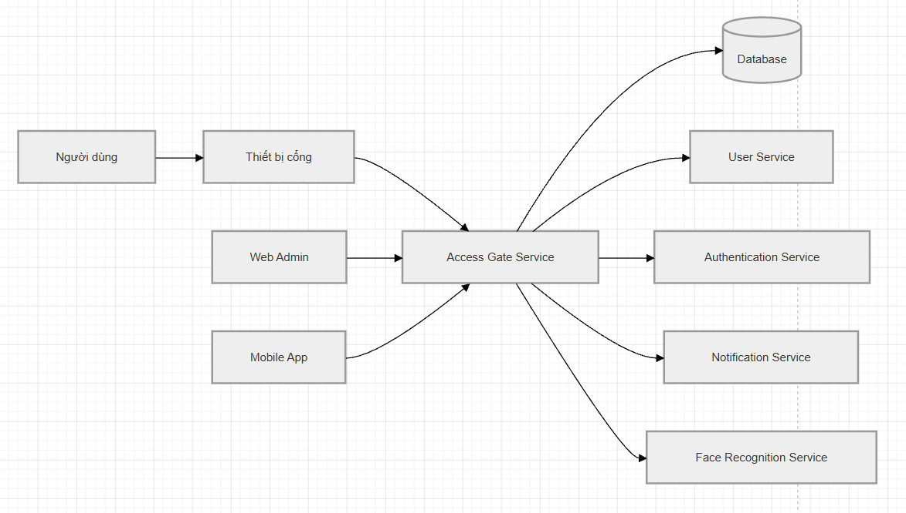

# Service Boundary của nhóm

## 1. Thông tin nhóm

- Tên nhóm:2
- Lớp:CNTT-1709
- Thành viên:Trần Văn Tuấn Anh, Lê Hải Đăng, Phạm Minh Hoàng.
- Service nhóm phụ trách:Access Gate
- Sản phẩm tổng thể của lớp:

## 2. Actor

Các đối tượng tương tác với hệ thống/service:

- Nhân viên
- Khách ra/vào
- Quản trị viên hệ thống
- Bảo vệ
- Camera / thiết bị quét QR hoặc RFID
- Các service khác trong hệ thống

## 3. System Boundary

Nhóm xây dựng Access Gate Service — service chịu trách nhiệm kiểm soát và ghi nhận việc ra/vào của người dùng.

Phần nhóm kiểm soát
- Xác thực quyền ra/vào
- Kiểm tra mã QR / RFID
- Ghi log lịch sử ra/vào
- Kiểm tra trạng thái hợp lệ của người dùng
- API mở cổng
- API kiểm tra trạng thái thiết bị
- Kết nối database lưu lịch sử
- Phần nhóm chỉ tích hợp
- Service quản lý người dùng
- Service nhận diện khuôn mặt
- Service thông báo
- Hệ thống camera
- Thiết bị phần cứng mở cổng

## 4. Service Boundary

Service của nhóm có trách nhiệm gì?
- Kiểm tra quyền truy cập của người dùng
- Xử lý yêu cầu mở cổng
- Ghi nhận thời gian ra/vào
- Gửi dữ liệu sang hệ thống lưu trữ
- Đồng bộ trạng thái với thiết bị cổng
- Trả kết quả xác thực cho client

Service KHÔNG làm gì?
- Không quản lý tài khoản người dùng
- Không xử lý thanh toán
- Không nhận diện khuôn mặt trực tiếp
- Không quản lý camera
- Không gửi email/SMS trực tiếp
- Không lưu dữ liệu phân tích AI

## 5. Input / Output

### Input

- Mã QR
- RFID card
- ID người dùng
- Dữ liệu từ camera
- Request từ client/mobile app
- Request từ thiết bị cổng

### Output

- Kết quả xác thực
- Trạng thái mở/đóng cổng
- Log lịch sử ra/vào
- Thông báo lỗi
- Dữ liệu thống kê truy cập

## 6. API dự kiến

| Method | Endpoint        | Mục đích                    |
| ------ | --------------- | --------------------------- |
| GET    | /health         | Kiểm tra trạng thái service |
| POST   | /access/check   | Kiểm tra quyền truy cập     |
| POST   | /access/open    | Yêu cầu mở cổng             |
| POST   | /access/log     | Ghi log ra/vào              |
| GET    | /access/history | Lấy lịch sử truy cập        |
| GET    | /gate/status    | Kiểm tra trạng thái cổng    |
| POST   | /device/connect | Kết nối thiết bị            |
| POST   | /rfid/scan      | Xử lý quét RFID             |
| POST   | /qr/scan        | Xử lý quét QR               |

## 7. Phụ thuộc service khác

Service này gọi đến service nào?
- User Service → kiểm tra thông tin người dùng
- Authentication Service → xác thực token
- Notification Service → gửi cảnh báo
- Face Recognition Service → xác minh khuôn mặt
Service nào gọi đến service này?
- Mobile App
- Web Admin
- Gate Device Service
- Camera Service

## 8. Sơ đồ minh họa

Có thể vẽ bằng Mermaid, draw.io, Ludichart hoặc ảnh chụp sơ đồ.

```mermaid
flowchart LR
    
